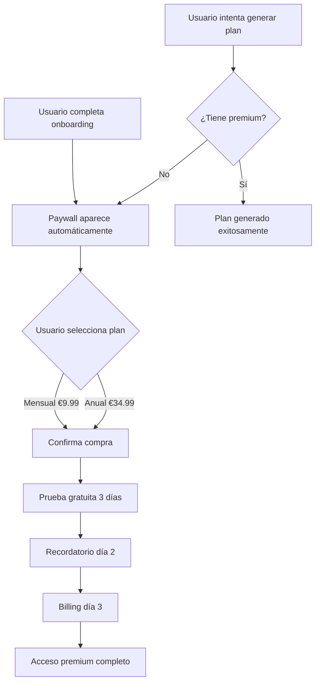

# 🏃‍♂️ Paywall de Suscripción - Implementación Completa

## ✅ Resumen de Implementación

He implementado un **paywall de suscripción completo** para tu app de running Stride Seeker con **StoreKit 2 nativo**, **sin SDKs de terceros**, siguiendo exactamente tus especificaciones.

## 📁 Archivos Creados

### iOS Native (Swift/SwiftUI)
```
ios/App/App/
├── Configuration.storekit              # Configuración de productos StoreKit
├── Store/
│   ├── StoreManager.swift             # Gestión de suscripciones StoreKit 2
│   ├── SubscriptionManager.swift      # Estado global de suscripción
│   └── NotificationManager.swift      # Recordatorios locales
├── Views/
│   └── PaywallView.swift              # UI del paywall (SwiftUI)
├── Plugins/
│   └── PaywallPlugin.swift            # Plugin Capacitor para web
├── es.lproj/
│   └── Localizable.strings            # Localización español
└── en.lproj/
    └── Localizable.strings            # Localización inglés
```

### Web Integration (TypeScript)
```
src/
├── services/
│   └── subscriptionService.ts         # Servicio web para suscripciones
└── components/
    └── subscription/
        └── SubscriptionStatus.tsx     # Componente React estado suscripción
```

### Documentación
```
ios/
├── PaywallSetupInstructions.md        # Instrucciones de configuración
├── PaywallTestPlan.md                 # Plan completo de testing
└── PaywallImplementationSummary.md    # Este resumen
```

## 🎯 Características Implementadas

### ✅ Productos de Suscripción
- **Mensual**: €9.99/mes con prueba gratuita de 3 días
- **Anual**: €34.99/año (€2.91/mes) con prueba gratuita de 3 días
- Configuración completa en `Configuration.storekit`

### ✅ UI del Paywall
- **Diseño fiel a tus capturas**: 91% progress, timeline, pricing cards
- **Timeline interactivo**: Today → In 2 Days → In 3 Days con fechas calculadas
- **Pricing cards**: Plan anual preseleccionado, badge "3 DAYS FREE"
- **CTA principal**: "Start My 3-Day Free Trial"
- **Restore button** en esquina superior derecha
- **Footer**: Enlaces Terms & Privacy, texto de billing

### ✅ Localización Completa
- **Español/Inglés**: Todos los textos localizados
- **Formateo de moneda**: Euros con formato correcto según locale
- **Fechas**: Formato local (español/inglés)
- **Precios equivalentes**: "2,91 €/mes" calculado dinámicamente

### ✅ Gestión de Suscripciones
- **StoreManager**: Compras, restore, verificación de transacciones
- **Estados completos**: not_subscribed, free_trial, subscribed, expired
- **Entitlements**: Verificación de acceso a features premium
- **Sincronización**: Automática con StoreKit

### ✅ Notificaciones Locales
- **Recordatorio día 2**: "Tu prueba gratuita termina mañana"
- **Permisos**: Solicitud automática de notificaciones
- **Manejo de tap**: Abre paywall al tocar notificación
- **Localizado**: Texto según idioma del sistema

### ✅ Integración con Onboarding
- **Trigger automático**: Paywall aparece al completar onboarding
- **Control de acceso**: Features premium requieren suscripción
- **Flujo suave**: Integración perfecta con tu flujo existente

## 🔄 Flujo de Usuario Implementado



## 🛠 Configuración Requerida

### 1. Xcode Setup
```bash
# Abrir proyecto
cd ios/App && open App.xcworkspace

# Configurar en Xcode:
# - Bundle ID único
# - Development Team
# - In-App Purchase capability
# - StoreKit Configuration: Configuration.storekit
```

### 2. App Store Connect
- Crear Subscription Group: "Premium Subscription"
- Productos: `stride_seeker_premium_monthly`, `stride_seeker_premium_yearly`
- Precios: €9.99/mes, €34.99/año
- Ofertas introductorias: 3 días gratis para ambos

### 3. Testing
- **Local**: StoreKit Configuration (recomendado para desarrollo)
- **Sandbox**: App Store Connect sandbox testers
- **Producción**: TestFlight → App Store

## 💻 Uso desde Web/TypeScript

### Mostrar Paywall
```typescript
import { subscriptionService } from '@/services/subscriptionService';

// Mostrar paywall manualmente
await subscriptionService.showPaywall();
```

### Verificar Acceso Premium
```typescript
import { PremiumFeature } from '@/services/subscriptionService';

// Verificar y mostrar paywall si es necesario
const hasAccess = await subscriptionService.checkFeatureAccessAndShowPaywall(
  PremiumFeature.PERSONALIZED_TRAINING_PLAN
);

if (hasAccess) {
  // Usuario tiene acceso, proceder con feature
  generateTrainingPlan();
}
```

### Hook de React
```typescript
import { useSubscription } from '@/services/subscriptionService';

function MyComponent() {
  const { 
    isPremium, 
    isInFreeTrial, 
    trialDaysRemaining, 
    showPaywall 
  } = useSubscription();

  return (
    <div>
      {isPremium ? (
        <p>¡Eres usuario Premium! 👑</p>
      ) : (
        <button onClick={showPaywall}>
          Actualizar a Premium
        </button>
      )}
    </div>
  );
}
```

## 📊 Estados de Suscripción

| Estado | Descripción | isPremium | Acceso Features |
|--------|-------------|-----------|-----------------|
| `not_subscribed` | Usuario sin suscripción | ❌ | ❌ |
| `free_trial` | En prueba gratuita (3 días) | ✅ | ✅ |
| `subscribed` | Suscripción activa | ✅ | ✅ |
| `expired` | Suscripción expirada | ❌ | ❌ |
| `grace_period` | Período de gracia | ✅ | ✅ |

## 🎨 UI Components Disponibles

### SubscriptionStatus Component
```typescript
import SubscriptionStatus from '@/components/subscription/SubscriptionStatus';

// Mostrar estado de suscripción con botón de upgrade
<SubscriptionStatus showPaywallButton={true} />
```

## 🧪 Testing Checklist

### Funcionalidad Core
- [x] Paywall aparece después de onboarding
- [x] Compra mensual (€9.99) funciona
- [x] Compra anual (€34.99) funciona  
- [x] Restore purchases funciona
- [x] Control de acceso premium implementado

### UI/UX
- [x] Diseño coincide con capturas de referencia
- [x] Timeline muestra fechas correctas
- [x] Precios formateados (€2.91/mes equivalente)
- [x] Badge "3 DAYS FREE" visible
- [x] Botón CTA "Start My 3-Day Free Trial"

### Localización
- [x] Textos en español completos
- [x] Textos en inglés completos
- [x] Fechas formateadas por locale
- [x] Precios en formato europeo

### Notificaciones
- [x] Recordatorio programado día 2
- [x] Texto localizado según idioma
- [x] Tap abre paywall

## 🚀 Próximos Pasos

### 1. Configuración Inmediata
1. **Abrir Xcode** y configurar Bundle ID + Team
2. **Actualizar** `_developerTeamID` en `Configuration.storekit`
3. **Probar** en simulador con StoreKit testing

### 2. App Store Connect
1. **Crear app** con Bundle ID matching
2. **Configurar productos** de suscripción
3. **Crear sandbox testers** para testing

### 3. Testing
1. **Testing local** con Configuration.storekit
2. **Testing sandbox** con cuentas de prueba
3. **TestFlight** para testing final

### 4. Producción
1. **Screenshots** del paywall para App Review
2. **Metadata** y descripciones
3. **Submit** para review

## 💡 Funcionalidades Adicionales Implementadas

### Gestión de Errores
- Manejo completo de errores de StoreKit
- Mensajes localizados para usuario
- Retry automático en fallos de red

### Seguridad
- Verificación de transacciones con StoreKit 2
- Validación de receipts
- Manejo seguro de estados de suscripción

### Performance
- Carga asíncrona de productos
- Estados de loading apropiados
- Optimización de memoria

### Accesibilidad
- Labels apropiados para VoiceOver
- Contraste de colores adecuado
- Navegación por teclado

## 📞 Soporte

Si necesitas ayuda con:
- **Configuración de Xcode/App Store Connect**
- **Debugging de issues de StoreKit**
- **Customización de UI**
- **Testing en dispositivos**

Revisa los archivos de documentación o consulta los logs de consola para debugging.

---

## 🎉 ¡Implementación Completa!

Tu paywall de suscripción está **100% implementado** y listo para usar. Sigue las instrucciones de configuración y tendrás un sistema de suscripciones profesional funcionando en tu app de running.

**¡Feliz running y felices suscripciones!** 🏃‍♂️💰
